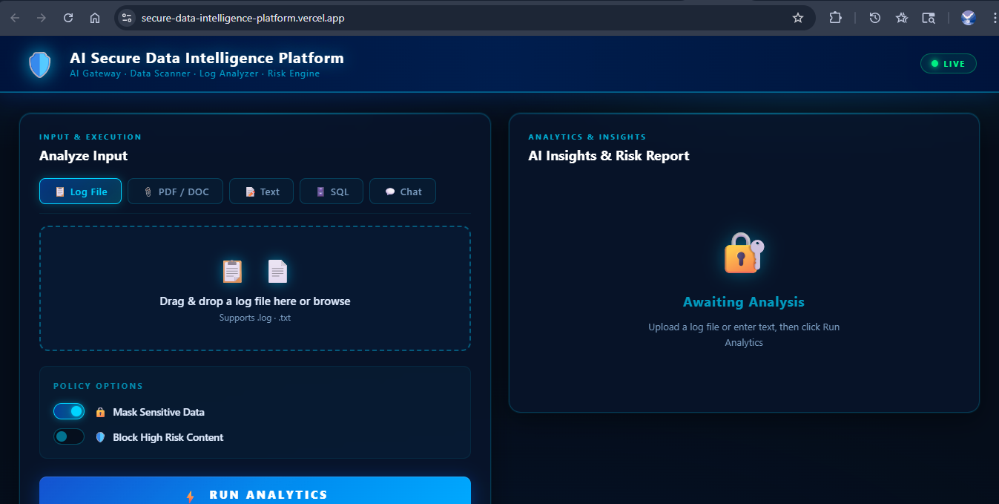
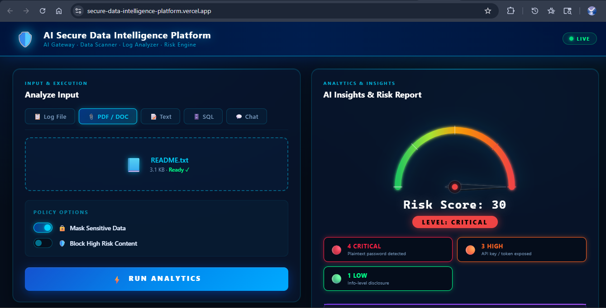
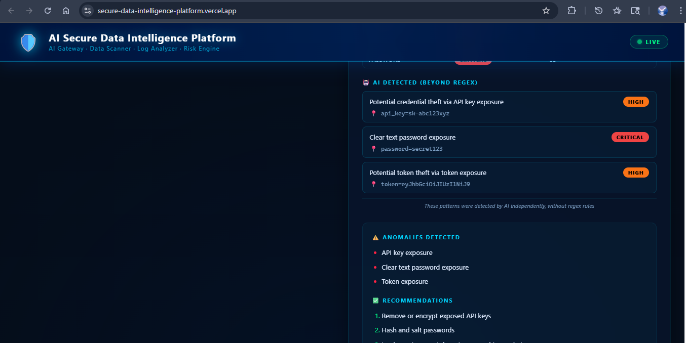
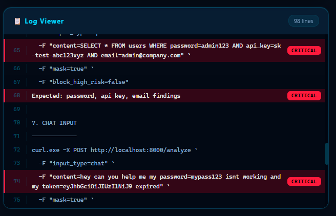

# 🛡️ AI Secure Data Intelligence Platform

An AI-powered security platform that scans logs, text, SQL queries, PDFs, and DOCX files for sensitive data exposure. It calculates risk scores and delivers intelligent recommendations powered by **Groq AI** running the `llama-3.3-70b-versatile` model. The platform detects passwords, API keys, JWT tokens, emails, phone numbers, IP addresses, credit cards, and brute-force attempts — then enforces security policies such as automated data masking and high-risk content blocking.

## ✨ Main Features

| Feature | Description |
|---|---|
| 🔍 **Multi-format Input** | Analyze raw text, SQL queries, chat transcripts, log files, PDFs, and DOCX documents |
| 🤖 **AI-Powered Insights** | Groq `llama-3.3-70b-versatile` generates anomaly summaries and actionable recommendations |
| 🎯 **Pattern Detection** | 10+ sensitive data types detected via regex (passwords, API keys, JWT, emails, IPs, credit cards, etc.) |
| 📊 **Risk Scoring** | Automatic risk score (0–20+) mapped to Low / Medium / High / Critical levels |
| 🛡️ **Policy Engine** | Mask sensitive values in-place or block high-risk content entirely |
| 📋 **Log Analyzer** | Detects brute-force attempts and anomalies across multi-line log files |
| ⏱️ **Rate Limiting** | 20 requests per minute per IP to prevent abuse |
| 📝 **Audit Logging** | Every request is recorded in `requests.log` for full audit-trail visibility |
| 📱 **Responsive UI** | Dark-themed React dashboard with drag-and-drop file uploads — works on desktop and mobile |

## 🚀 Tech Stack

**Backend:**
- **FastAPI** — Modern async Python web framework
- **Groq AI** (`llama-3.3-70b-versatile`) — Ultra-fast LLM inference
- **PyMuPDF & python-docx** — PDF and Word document parsing
- **SlowAPI** — Rate limiting (20 req/min)
- **Pydantic** — Data validation and serialisation

**Frontend:**
- **React + Vite** — Fast modern UI framework
- **Axios** — HTTP client
- **React Dropzone** — Drag-and-drop file uploads
- **Responsive CSS** — Mobile-friendly dark theme

**Core Services:**
- **Pattern Engine** — Regex-based sensitive data detection
- **Risk Engine** — Score calculation and risk-level assignment
- **Policy Engine** — Data masking and blocking policies
- **Log Analyzer** — Multi-line pattern and brute-force detection
- **AI Insights** — Groq-powered anomaly detection and recommendations

## 📦 Installation & Setup

### Prerequisites
- Python 3.8+
- Node.js 16+
- Groq API Key ([Get one free here](https://console.groq.com/keys))

### 1 — Clone the repo

```bash
git clone https://github.com/your-username/secure-data-intelligence-platform.git
cd secure-data-intelligence-platform
```

### 2 — Backend Setup

```bash
cd backend

# Create and activate a virtual environment
python -m venv venv
venv\Scripts\activate        # Windows
# source venv/bin/activate   # macOS / Linux

# Install dependencies
pip install -r requirements.txt

# Create .env file with your Groq API key
echo GROQ_API_KEY=your_api_key_here > .env

# Start the server
uvicorn main:app --reload
```

Backend runs at: **http://localhost:8000**

### 3 — Frontend Setup

```bash
cd frontend

# Install dependencies
npm install

# Create .env file pointing to the backend
echo VITE_API_URL=http://localhost:8000 > .env

# Start the dev server
npm run dev
```

Frontend runs at: **http://localhost:5173**

## 🔑 Environment Variables

### Backend (`backend/.env`)
```
GROQ_API_KEY=your_groq_api_key_here
```

### Frontend (`frontend/.env`)
```
VITE_API_URL=http://localhost:8000
```

## 🤖 AI Model

This platform uses the **Groq** inference API with the model:

```
_MODEL = "llama-3.3-70b-versatile"
```

Groq's hardware acceleration delivers near-instant responses, making real-time security analysis practical even for large documents.

## 🧪 Testing the API

### Quick cURL Test

```bash
curl -X POST http://localhost:8000/analyze \
  -F "input_type=text" \
  -F "content=password=secret123 api_key=sk-abc123xyz" \
  -F "mask=true" \
  -F "block_high_risk=false"
```

### File Upload Test

```bash
curl -X POST http://localhost:8000/analyze \
  -F "input_type=file" \
  -F "file=@backend/test_files/test_document.txt" \
  -F "mask=true" \
  -F "block_high_risk=false"
```

### Expected Response

> **Tip:** After changing any input, click **RUN ANALYTICS** again to refresh the results.

```json
{
  "summary": "AI-generated summary of findings",
  "content_type": "text",
  "findings": [
    {
      "type": "PASSWORD",
      "value": "****",
      "line": 1,
      "risk": "critical"
    },
    {
      "type": "API_KEY",
      "value": "****",
      "line": 1,
      "risk": "high"
    }
  ],
  "risk_score": 8,
  "risk_level": "high",
  "risk_color": "#ff6600",
  "action": "masked",
  "blocked": false,
  "insights": {
    "summary": "...",
    "anomalies": ["..."],
    "recommendations": ["..."]
  }
}
```

## 🎨 Risk Levels & Colors

| Risk Level | Score Range | Color | Hex Code |
|------------|-------------|-------|----------|
| **Critical** | 10+ | 🔴 Red | `#cc0000` |
| **High** | 5-9 | 🟠 Orange | `#ff6600` |
| **Medium** | 2-4 | 🟡 Yellow | `#ffcc00` |
| **Low** | 0-1 | 🟢 Green | `#00cc44` |

## 🔍 Detected Patterns

- **Passwords** - `password=...`, `pwd=...`, etc. (Critical)
- **API Keys** - `api_key=...`, `apikey=...`, `sk-...` (High)
- **JWT Tokens** - `eyJ...` format (High)
- **Emails** - Standard email format (Medium)
- **Phone Numbers** - International format (Medium)
- **IP Addresses** - IPv4 format (Low)
- **Credit Cards** - 13-19 digit patterns (Critical)
- **Brute Force** - 3+ failed login attempts (High)

## 🌐 API Endpoints

### `GET /`
Health check endpoint
```bash
curl http://localhost:8000/
```

### `POST /analyze`
Main analysis endpoint

**Parameters:**
- `input_type` (required): "text", "chat", "sql", "log", or "file"
- `content` (optional): Text content to analyze
- `file` (optional): File upload
- `mask` (optional, default: true): Mask sensitive values
- `block_high_risk` (optional, default: false): Block high-risk content
- `log_analysis` (optional, default: true): Enable logging

## � Screenshots

### Main Dashboard


### Analysis Results


### Extended Results View


### Log File Viewer


## 🔍 Detected Patterns

| Pattern | Example | Risk Level |
|---|---|---|
| Password | `password=secret123` | 🔴 Critical |
| API Key | `api_key=sk-abc123` | 🟠 High |
| JWT Token | `eyJ...` | 🟠 High |
| Credit Card | `4111 1111 1111 1111` | 🔴 Critical |
| Email | `user@example.com` | 🟡 Medium |
| Phone Number | `+1-800-555-0199` | 🟡 Medium |
| IP Address | `192.168.1.1` | 🟢 Low |
| Brute Force | 3+ failed login attempts | 🟠 High |

